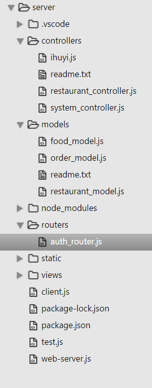
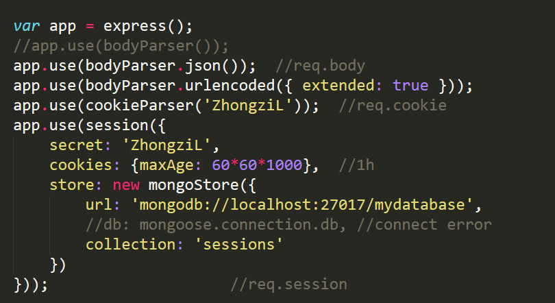
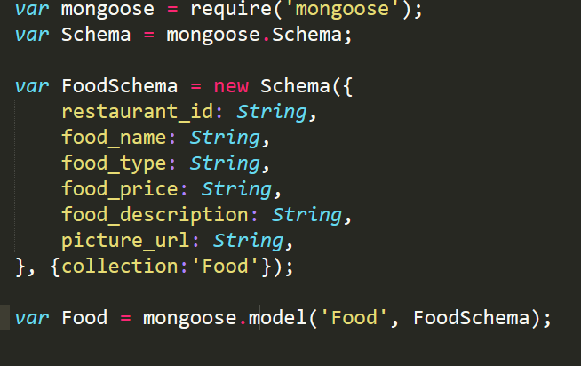
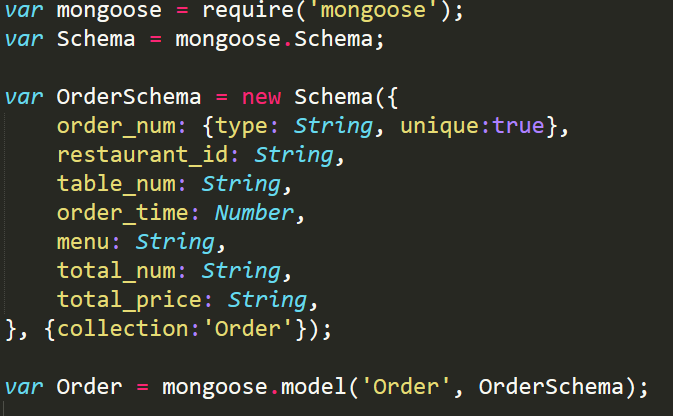
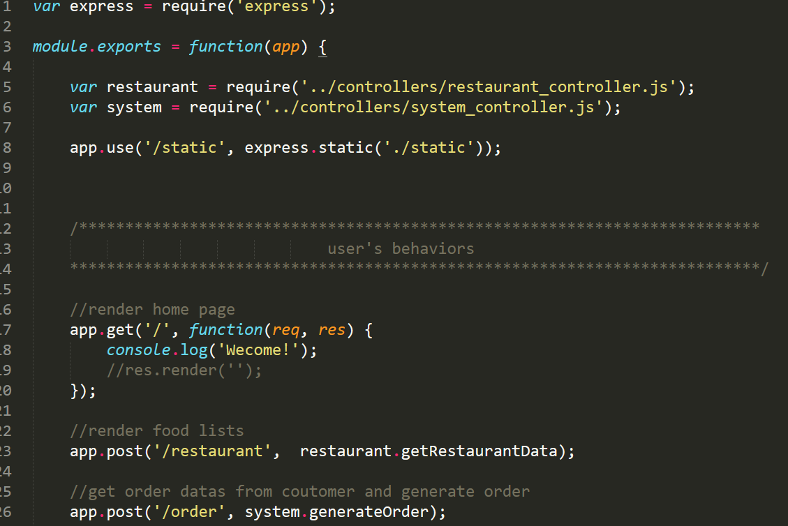
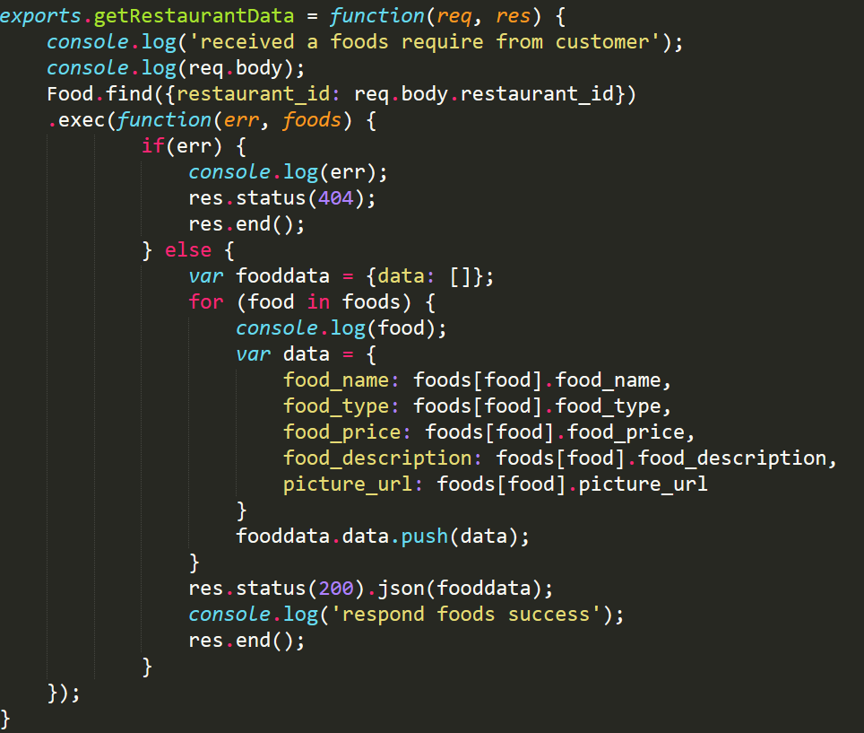

# 利用Nodejs及MongoDB搭建服务后端

## 配置实验环境
环境：ubuntu16.04
### 下载nodejs
- 输入命令以下命令，进行nodejs的下载
```
apt-get install nodejs nodejs nodejs-legacy -y
```
### 下载mongodb
- 输入命令以下命令，进行nodejs的下载
```
apt-get install mongodb -y
```
### 下载npm
- 输入命令以下命令，进行npm的下载
```
apt-get install npm -y
```

## 进行后端开发
创建项目目录，在目录下进行开发
- node_modules目录存放第三方包的数据（透过npm下载的包会自动存到该目录下）
- models目录存放数据库格式文件，定义储存的数据格式
- routers目录存放路由文件，进行url路由
- controllers目录存放操作文件，对应于每个url进行操作
- view存放静态的html文件
- static存放对于html下的css及js文件

### 利用npm进行模块下载
- 在开发目录下利用npm，下载开发所用到的api
- 下载express api
### 引用express框架
- 在express框架下进行后端开发

### 定义数据库格式
- 根据开发的需求，定义food和order数据格式


### 实现url路由
- 透过路由文件进行url的路由，对应在controller不同的操作函数

### 实现api请求操作
- 根据不同url，编写不同的操作函数

### 实现数据的增删改查


## 对mongoDB进行操作
### 查看存在的数据库
### 进入数据库
### 查看该数据库下的表
### 查看该表下的数据
### 删除该表下的数据

